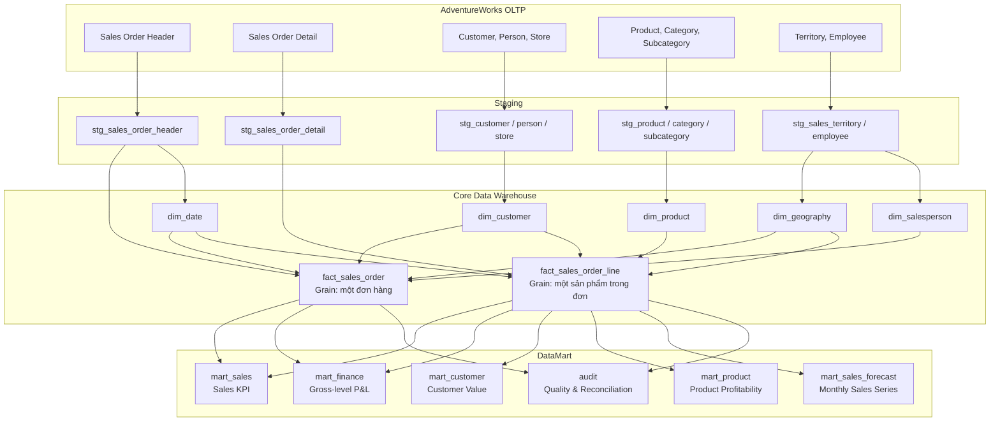
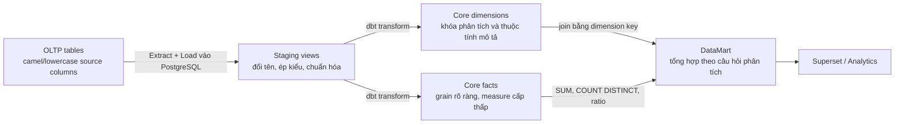
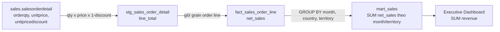
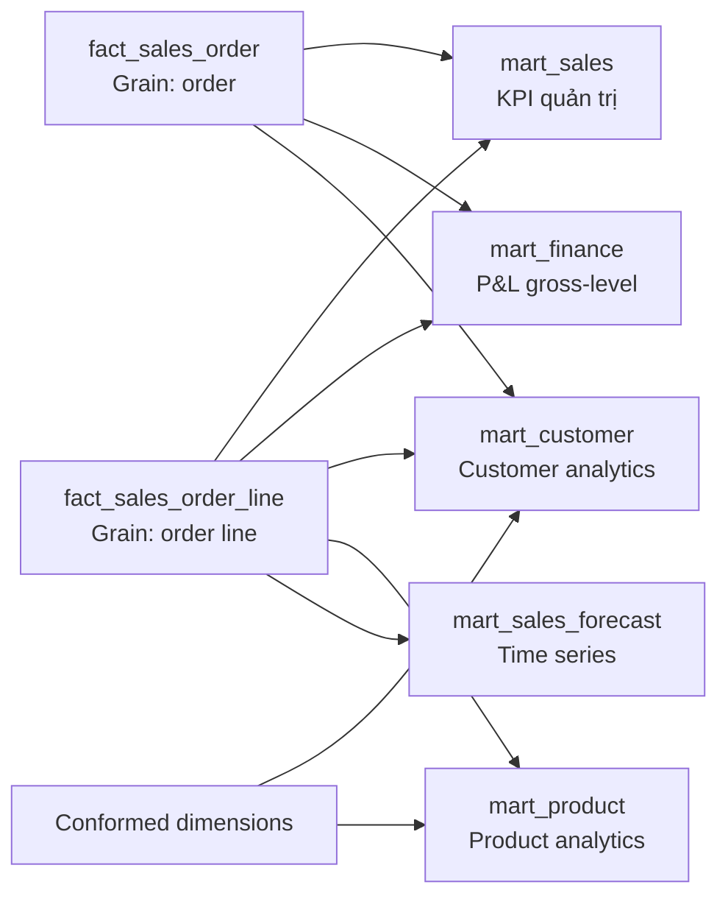
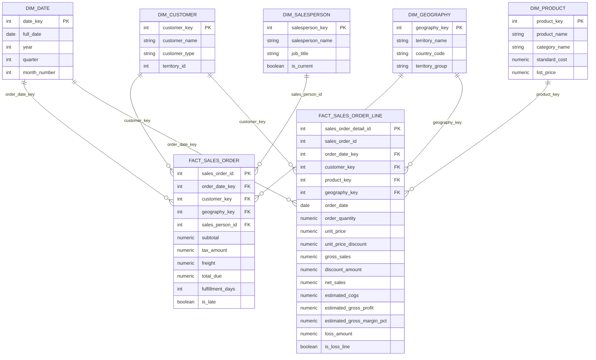

# Thiết kế và Metrics của Kho Dữ Liệu

## 1. Mục tiêu thiết kế

Kho Dữ Liệu chuyển dữ liệu giao dịch AdventureWorks thành nguồn dữ liệu phân
tích thống nhất. Thiết kế phục vụ các mục đích:

1. Chuẩn hóa công thức KPI bán hàng và lợi nhuận gross-level.
2. Phân tích theo thời gian, khách hàng, sản phẩm và thị trường.
3. Cung cấp DataMart cho dashboard và các bài toán phân tích.
4. Kiểm tra dữ liệu sau ELT có khớp với nguồn hay không.

Dashboard không tự join trực tiếp các bảng OLTP. Dữ liệu phải đi qua staging,
Core DW và DataMart để đảm bảo grain và công thức nhất quán.

## 2. Kiến trúc các lớp dữ liệu



### 2.1 Luồng ELT từ OLTP sang DWH



Quy trình là ELT:

1. **Extract/Load:** dữ liệu AdventureWorks được import vào PostgreSQL và giữ
   cấu trúc OLTP.
2. **Transform staging:** dbt tạo view chuẩn hóa tên cột, kiểu dữ liệu và các
   trường dẫn xuất đơn giản.
3. **Transform Core DW:** tạo dimension và fact tại grain thấp nhất cần phân
   tích.
4. **Transform DataMart:** tổng hợp measure theo month, customer, product hoặc
   territory.
5. **Serve:** Superset và lớp analytics chỉ đọc Core DW/DataMart.

### 2.2 Mapping từ bảng OLTP tới staging

| OLTP | Staging | Xử lý chính |
|---|---|---|
| `sales.salesorderheader` | `stg_sales_order_header` | Chuẩn hóa order date, customer, territory, subtotal, tax, freight và trạng thái giao hàng |
| `sales.salesorderdetail` | `stg_sales_order_detail` | Chuẩn hóa quantity, unit price, discount và tính line total |
| `sales.customer` | `stg_customer` | Chuẩn hóa customer ID, person/store ID và territory |
| `person.person` | `stg_person` | Chuẩn hóa tên khách hàng/nhân viên |
| `sales.store` | `stg_store` | Chuẩn hóa thông tin khách hàng doanh nghiệp |
| `production.product` | `stg_product` | Chuẩn hóa product, standard cost và list price |
| `production.productsubcategory` | `stg_product_subcategory` | Ánh xạ product vào subcategory |
| `production.productcategory` | `stg_product_category` | Ánh xạ subcategory vào category |
| `sales.salesterritory` | `stg_sales_territory` | Chuẩn hóa territory, country và territory group |
| `humanresources.employee` | `stg_employee` | Chuẩn hóa nhân viên và chức danh |

Staging giữ grain gần với nguồn và chưa tổng hợp KPI. Mục tiêu của staging là
tạo đầu vào sạch, dễ đọc và ổn định cho Core DW.

### 2.3 Dimension được tạo như thế nào?

| Dimension | Nguồn | Cách xây dựng | Phục vụ |
|---|---|---|---|
| `dim_date` | Khoảng ngày của sales order | Sinh một dòng cho mỗi ngày và bổ sung year, quarter, month | Phân tích thời gian |
| `dim_customer` | Customer + Person + Store | Gộp khách cá nhân và khách doanh nghiệp tại grain customer | Phân tích giá trị khách hàng |
| `dim_product` | Product + Subcategory + Category | Gắn product với tên nhóm, standard cost và list price | Phân tích sản phẩm/lợi nhuận |
| `dim_geography` | Sales Territory | Một dòng cho mỗi territory, có country và group | So sánh thị trường |
| `dim_salesperson` | Employee + Person | Chọn nhân viên bán hàng và bổ sung tên/chức danh | Phân tích salesperson |

Các dimension chứa thuộc tính mô tả, không chứa measure bán hàng cần cộng.

### 2.4 `fact_sales_order` được tạo như thế nào?

Nguồn chính: `stg_sales_order_header`.

Mỗi source order tạo đúng một dòng fact:

```text
salesorderid  -> sales_order_id
orderdate     -> order_date, order_date_key
customerid    -> customer_key
territoryid   -> geography_key
salespersonid -> sales_person_id
subtotal      -> subtotal
taxamt        -> tax_amount
freight       -> freight
totaldue      -> total_due
```

Các metric vận hành được dẫn xuất trước khi nạp vào fact:

```text
fulfillment_days = ship_date - order_date
is_late = ship_date > due_date
```

Không có phép tổng hợp ở bước này; grain vẫn là một order.

### 2.5 `fact_sales_order_line` được tạo như thế nào?

Nguồn chính: `stg_sales_order_detail`, sau đó join với:

- `stg_sales_order_header` để lấy date, customer, territory và thuộc tính order.
- `stg_product` để lấy standard cost.
- `stg_sales_territory` để lấy country code.

Mỗi source order detail tạo đúng một dòng fact. Các measure được tính ở cấp
dòng trước khi tổng hợp:

```text
gross_sales = order_quantity * unit_price
discount_amount = order_quantity * unit_price * unit_price_discount
net_sales = order_quantity * unit_price * (1 - unit_price_discount)
estimated_cogs = order_quantity * standard_cost
estimated_gross_profit = net_sales - estimated_cogs
estimated_gross_margin_pct = estimated_gross_profit / net_sales
is_loss_line = net_sales < estimated_cogs
loss_amount = MAX(estimated_cogs - net_sales, 0)
```

Việc tính measure ở grain thấp nhất giúp DataMart có thể tổng hợp theo bất kỳ
dimension nào mà không phải quay lại OLTP.

### 2.6 Ví dụ lineage của Revenue



Ví dụ một source line có:

```text
Quantity = 2
Unit Price = 100
Discount = 10%
```

Qua từng lớp:

```text
Staging line_total = 2 x 100 x (1 - 10%) = 180
Fact net_sales = 180
Monthly mart cộng 180 vào đúng month/territory
Executive KPI cộng 180 vào tổng Revenue
```

### 2.7 Metrics được tổng hợp lên DataMart như thế nào?

#### Metric cộng trực tiếp

Các metric sau có thể dùng `SUM` từ fact line:

```text
Quantity Sold = SUM(order_quantity)
Gross Sales = SUM(gross_sales)
Discount Amount = SUM(discount_amount)
Revenue = SUM(net_sales)
Estimated COGS = SUM(estimated_cogs)
Estimated Gross Profit = SUM(estimated_gross_profit)
Loss Amount = SUM(loss_amount)
```

Chúng là additive measure vì có thể cộng theo date, product, customer và
territory.

#### Metric cần đếm riêng

```text
Order Count = COUNT(DISTINCT sales_order_id)
Sales Line Count = COUNT(sales_order_detail_id)
Loss Line Count = COUNT(*) FILTER (WHERE is_loss_line)
```

Không cộng `Order Count` của nhiều nhóm chồng lấn. Một order có thể chứa nhiều
product nên tổng order count theo product có thể lớn hơn order count toàn doanh
nghiệp.

#### Metric ratio phải tính lại sau tổng hợp

```text
Gross Margin = SUM(gross_profit) / SUM(revenue)
AOV = SUM(revenue) / COUNT(DISTINCT order_id)
Loss Line Rate = SUM(loss_line_count) / SUM(sales_line_count)
```

Không dùng `AVG` các ratio cấp dòng vì các dòng có trọng số khác nhau.

#### Metric theo thời gian

Sau khi tạo Revenue ở grain tháng, dbt dùng window function:

```text
Revenue Change = Revenue - LAG(Revenue)
Revenue Growth = Revenue / LAG(Revenue) - 1
YoY Growth = Revenue / LAG(Revenue, 12) - 1
```

Metric tăng trưởng chỉ được tính sau khi Revenue đã tổng hợp về đúng grain
thời gian.

### 2.8 Grain của từng DataMart

| DataMart | Grain | Cách tổng hợp |
|---|---|---|
| `executive_kpi` | Một dòng toàn doanh nghiệp | Tổng hợp toàn bộ fact line/order |
| `sales_monthly_kpi` | Month + Country + Territory | `GROUP BY month, country, territory` |
| `sales_country_year_kpi` | Country + Year | `GROUP BY country, year` |
| `management_pnl_monthly` | Month + Country + Territory | Tổng Revenue/COGS/Profit và join metric order cùng grain |
| `customer_base` | Customer | `GROUP BY customer_key` |
| `product_sales_summary` | Product | `GROUP BY product_key` |
| `monthly_sales_series` | Month | `GROUP BY month` |
| `source_to_dw_reconciliation` | Một dòng/một metric kiểm tra | So sánh source value và DW value |

### 2.9 Ví dụ tổng hợp cùng một fact theo nhiều DataMart

Giả sử fact line có ba dòng:

| Month | Customer | Product | Territory | Revenue | Gross Profit |
|---|---|---|---|---:|---:|
| 2025-07 | C01 | A | US | 180 | 60 |
| 2025-07 | C01 | B | US | 40 | -15 |
| 2025-07 | C02 | A | CA | 120 | 30 |

Kết quả theo tháng:

```text
Revenue 2025-07 = 180 + 40 + 120 = 340
Gross Profit 2025-07 = 60 - 15 + 30 = 75
Monthly Margin = 75 / 340 = 22,06%
```

Kết quả theo customer:

```text
C01 Revenue = 180 + 40 = 220
C01 Gross Profit = 60 - 15 = 45
C02 Revenue = 120
C02 Gross Profit = 30
```

Kết quả theo product:

```text
Product A Revenue = 180 + 120 = 300
Product A Gross Profit = 60 + 30 = 90
Product B Revenue = 40
Product B Gross Profit = -15
```

Cùng một fact line được tổng hợp theo nhiều dimension nhưng tổng Revenue toàn
bộ vẫn phải bằng 340. Đây là lợi ích của việc tính measure một lần tại Core DW
rồi tái sử dụng cho các DataMart.

## 3. Thiết kế và vai trò của DataMart

### 3.1 DataMart là gì?

DataMart là lớp dữ liệu được tổ chức theo một chủ đề hoặc một nhóm câu hỏi
nghiệp vụ cụ thể. Core DW giữ dữ liệu ở grain chi tiết và dùng chung, trong khi
DataMart tổng hợp dữ liệu thành cấu trúc thuận tiện cho phân tích.

Trong đồ án, DataMart không phải dữ liệu mô phỏng và cũng không phải một Kho
Dữ Liệu tách biệt. Các mart đều được dbt tạo từ dimension và fact của Core DW.
Vì vậy, chúng kế thừa cùng nguồn dữ liệu, grain và công thức metric đã được
chuẩn hóa.

Việc xây dựng DataMart có các mục đích:

1. Giảm số lượng phép join và phép tính mà dashboard phải thực hiện.
2. Cố định grain phù hợp với từng câu hỏi phân tích.
3. Bảo đảm Superset, Streamlit và Data Mining sử dụng cùng công thức KPI.
4. Hạn chế cộng trùng metric cấp order và metric cấp order line.
5. Tăng khả năng đọc hiểu và tái sử dụng dữ liệu.



### 3.2 DataMart bán hàng

Schema `mart_sales` cung cấp các KPI bán hàng ở nhiều mức tổng hợp.

#### `executive_kpi`

Grain là một dòng cho toàn bộ phạm vi dữ liệu. Bảng tổng hợp trực tiếp từ
`fact_sales_order_line` và cung cấp khoảng thời gian dữ liệu, số đơn hàng, số
dòng bán, sản lượng, doanh thu, giá vốn, lợi nhuận gộp, biên lợi nhuận, giá trị
bán dưới giá vốn và AOV.

Bảng này phục vụ các KPI ở đầu dashboard quản trị. Người dùng có thể nhìn nhanh
quy mô, hiệu quả và rủi ro lợi nhuận của doanh nghiệp mà không phải tự tổng hợp
fact.

#### `sales_monthly_kpi`

Grain của bảng là:

```text
Month + Country + Territory
```

Bảng tổng hợp doanh thu, chiết khấu, giá vốn, lợi nhuận, số đơn và số dòng bán
theo tháng và khu vực. Sau khi tổng hợp về grain tháng, bảng dùng `LAG` để tính:

```text
Revenue Change = Revenue hiện tại - Revenue tháng trước
Revenue Growth = Revenue hiện tại / Revenue tháng trước - 1
```

Mart này phục vụ phân tích xu hướng, so sánh thị trường và phát hiện tháng hoặc
khu vực tăng trưởng bất thường.

#### `sales_country_year_kpi`

Grain là `Country + Year`. Bảng phục vụ so sánh số đơn, doanh thu, lợi nhuận,
biên lợi nhuận và AOV giữa các quốc gia theo năm.

### 3.3 DataMart tài chính quản trị

Schema `mart_finance` trình bày kết quả kinh doanh ở mức lợi nhuận gộp. Đây
không phải báo cáo tài chính kế toán đầy đủ.

#### `management_pnl_monthly`

Grain của bảng là `Month + Country + Territory`. Mart sử dụng cả hai fact
nhưng không join chúng ở grain chi tiết:

1. `fact_sales_order_line` được tổng hợp theo tháng và khu vực để lấy Revenue,
   Estimated COGS, Estimated Gross Profit và Loss Amount.
2. `fact_sales_order` được tổng hợp độc lập theo cùng grain để lấy Tax, Freight
   và Total Due.
3. Hai kết quả đã tổng hợp được join bằng Month và Geography Key.

Cách làm này tránh lặp tax và freight trên từng dòng sản phẩm. Trường
`accounting_scope = gross_level_only` nhắc người dùng rằng mart không thể hiện
lợi nhuận hoạt động hoặc lợi nhuận ròng.

#### `management_pnl_summary`

Grain là một dòng cho một khoản mục P&L. Bảng trình bày bốn khoản mục: Doanh
thu, Giá vốn ước tính, Lợi nhuận gộp ước tính và Giá trị lỗ ở các dòng bán dưới
giá vốn. Cấu trúc này phù hợp với bảng P&L hoặc biểu đồ waterfall.

### 3.4 DataMart khách hàng

Schema `mart_customer` đưa dữ liệu bán hàng về grain khách hàng để phục vụ EDA
và phân cụm.

#### `customer_base`

Grain là một dòng trên một khách hàng. Bảng kết hợp `dim_customer` với
`fact_sales_order_line` để tính ngày mua đầu tiên và gần nhất, số đơn, sản
lượng, doanh thu, lợi nhuận gộp, biên lợi nhuận và AOV.

Mart phục vụ xếp hạng khách hàng theo giá trị, phân tích theo loại và khu vực,
đồng thời cung cấp dữ liệu EDA trước khi clustering.

#### `customer_rfm`

Grain là một dòng trên một khách hàng đã phát sinh đơn hàng. Các biến RFM được
tính từ `fact_sales_order`:

```text
Recency = Ngày tham chiếu - Ngày mua gần nhất
Frequency = Số đơn hàng phân biệt
Monetary = Tổng subtotal của khách hàng
```

Ngày tham chiếu bằng ngày giao dịch lớn nhất cộng một ngày. Cách chọn này phù
hợp với dữ liệu lịch sử và không phụ thuộc ngày chạy hệ thống. Mart là đầu vào
trực tiếp cho K-Means phân khúc khách hàng.

### 3.5 DataMart sản phẩm

Schema `mart_product` chứa `product_sales_summary` với grain một dòng trên một
sản phẩm. Bảng kết hợp `dim_product` và `fact_sales_order_line` để tổng hợp sản
lượng, doanh thu, giá vốn, lợi nhuận, biên lợi nhuận và giá trị bán dưới giá
vốn.

Mart giúp phân biệt sản phẩm bán nhiều, sản phẩm tạo doanh thu cao và sản phẩm
tạo lợi nhuận cao. Đây là nguồn cho dashboard EDA sản phẩm. Dữ liệu order line
chi tiết vẫn được dùng riêng cho FP-Growth vì mô hình cần biết các sản phẩm
xuất hiện cùng một đơn hàng.

### 3.6 DataMart chuỗi thời gian

Schema `mart_sales_forecast` chuẩn bị dữ liệu tháng cho phân tích xu hướng và
dự báo.

#### `monthly_sales_series`

Grain là một dòng trên một tháng. Bảng tổng hợp số đơn, sản lượng, doanh thu,
giá vốn, lợi nhuận và biên lợi nhuận toàn doanh nghiệp. Grain tháng tạo chuỗi
thời gian thống nhất cho huấn luyện và so sánh mô hình dự báo.

#### `monthly_sales_eda`

Bảng mở rộng chuỗi tháng với năm, số tháng, cờ `is_complete_month`, mức thay đổi
doanh thu cùng kỳ và tăng trưởng YoY:

```text
YoY Change = Revenue tháng hiện tại - Revenue cùng tháng năm trước
YoY Growth = Revenue tháng hiện tại / Revenue cùng tháng năm trước - 1
```

Cờ tháng hoàn chỉnh giúp dashboard không diễn giải sai kỳ cuối chưa đủ dữ liệu.
Superset sử dụng mart này cho EDA, còn mô hình dự báo sử dụng chuỗi tháng đã
chuẩn hóa.

### 3.7 DataMart được sử dụng ở đâu?

| DataMart | Superset sử dụng để | Data Mining sử dụng để |
|---|---|---|
| `mart_sales` | KPI tổng quan, xu hướng và thị trường | Không dùng trực tiếp |
| `mart_finance` | P&L gross-level và rò rỉ lợi nhuận | Không dùng trực tiếp |
| `mart_customer` | Customer EDA và giá trị khách hàng | RFM và K-Means |
| `mart_product` | Product EDA và profitability | Hỗ trợ diễn giải FP-Growth |
| `mart_sales_forecast` | EDA xu hướng, mùa vụ và YoY | Dự báo doanh thu |

Superset tập trung trình bày dữ liệu lịch sử và insight EDA. Streamlit tập trung
trình bày kết quả mô hình và hỗ trợ tương tác. Việc phân vai này hạn chế trùng
lặp giữa hai công cụ.

### 3.8 Nguyên tắc kiểm tra DataMart

Một DataMart chỉ đáng tin cậy khi thỏa các điều kiện:

1. Grain được xác định rõ và khóa của grain không bị trùng.
2. Tổng Revenue ở các mart phải đối soát được với Core DW.
3. Metric ratio phải được tính từ tổng tử số và mẫu số.
4. Metric từ hai fact chỉ được kết hợp sau khi tổng hợp về cùng grain.
5. Tháng chưa đầy đủ phải được đánh dấu trước khi trình bày tăng trưởng.

Ví dụ, tổng Revenue của `product_sales_summary`, `customer_base` và
`monthly_sales_series` phải bằng tổng `net_sales` của `fact_sales_order_line`
nếu áp dụng cùng phạm vi dữ liệu. Chênh lệch không giải thích được cho thấy lỗi
join, lọc hoặc grain.

## 4. Chi tiết dimension và fact



## 5. Tại sao cần hai fact?

AdventureWorks phát sinh measure ở hai cấp nghiệp vụ khác nhau:

| Fact | Grain | Measure chính | Câu hỏi phục vụ |
|---|---|---|---|
| `fact_sales_order` | Một dòng/một order | tax, freight, total due, fulfillment | Có bao nhiêu đơn? Giá trị đơn bao nhiêu? Giao hàng có trễ không? |
| `fact_sales_order_line` | Một dòng/một sản phẩm trong order | quantity, price, discount, revenue, COGS, profit | Bán sản phẩm nào? Sản phẩm nào tạo doanh thu, profit hoặc loss? |

Nếu chỉ dùng fact line, tax và freight sẽ bị lặp lại trên từng sản phẩm. Ví dụ
một order có ba sản phẩm và freight bằng 100, `SUM(freight)` sẽ cho 300.

Nếu chỉ dùng fact order, không thể phân tích quantity, price, discount, cost và
profit theo sản phẩm.

Gộp hai grain trong một bảng sẽ tạo mixed-grain fact và khiến người dùng rất
dễ cộng sai metric. Vì vậy, hai fact được giữ độc lập và cùng liên kết với các
dimension dùng chung.

`sales_order_id` trong fact line là degenerate key để truy vết giao dịch, đối
soát và tạo basket. Nó không biến fact order thành dimension.

## 6. Ví dụ dữ liệu dùng chung

Giả sử order `SO-1001` gồm hai dòng:

| Product | Quantity | Unit Price | Discount | Standard Cost |
|---|---:|---:|---:|---:|
| Product A | 2 | 100 | 10% | 60 |
| Product B | 1 | 50 | 20% | 55 |

Thông tin cấp order:

- Order date: 01/07/2025.
- Due date: 03/07/2025.
- Ship date: 04/07/2025.
- Tax: 22.
- Freight: 8.

Các phần dưới dùng cùng dữ liệu này để minh họa từng metric.

## 7. Sales Metrics

### 7.1 Gross Sales

```text
Gross Sales = SUM(Quantity x Unit Price)
```

Ý nghĩa: giá trị bán trước chiết khấu.

Mục đích: đo quy mô bán theo giá gốc và làm cơ sở tính Discount Amount.

**Ví dụ:**

```text
Product A = 2 x 100 = 200
Product B = 1 x 50 = 50
Total Gross Sales = 200 + 50 = 250
```

### 7.2 Discount Amount

```text
Discount Amount = SUM(Quantity x Unit Price x Discount Rate)
```

Ý nghĩa: phần giá trị bán bị giảm do chiết khấu.

Mục đích: đo quy mô ưu đãi và kiểm tra discount có làm giảm profitability hay
không.

**Ví dụ:**

```text
Discount A = 200 x 10% = 20
Discount B = 50 x 20% = 10
Total Discount = 20 + 10 = 30
```

### 7.3 Revenue

```text
Revenue = Gross Sales - Discount Amount
```

Ý nghĩa: doanh thu hàng hóa sau chiết khấu, chưa gồm tax và freight.

Mục đích: KPI quy mô kinh doanh chính; dùng để phân tích theo thời gian,
customer, product và territory.

**Ví dụ:**

```text
Revenue A = 200 - 20 = 180
Revenue B = 50 - 10 = 40
Total Revenue = 180 + 40 = 220
```

### 7.4 Order Count

```text
Order Count = COUNT(DISTINCT Sales Order ID)
```

Ý nghĩa: số giao dịch bán hàng, không phải số dòng sản phẩm.

Mục đích: đo mức độ hoạt động và phân biệt tăng doanh thu do nhiều order với
tăng do order lớn hơn.

**Ví dụ:**

Order `SO-1001` có hai product line nhưng:

```text
Order Count = 1
Sales Line Count = 2
```

### 7.5 Sales Line Count

```text
Sales Line Count = COUNT(Sales Order Detail ID)
```

Ý nghĩa: tổng số dòng sản phẩm trong các order.

Mục đích: đối soát số dòng và làm mẫu số của Loss Line Rate.

**Ví dụ:**

```text
SO-1001 có Product A và Product B
Sales Line Count = 2
```

### 7.6 Quantity Sold

```text
Quantity Sold = SUM(Order Quantity)
```

Ý nghĩa: tổng số đơn vị sản phẩm đã bán.

Mục đích: tìm sản phẩm bán chạy và so sánh sản lượng với revenue/profit.

**Ví dụ:**

```text
Quantity Sold = 2 + 1 = 3 sản phẩm
```

### 7.7 Average Order Value

```text
Average Order Value = Revenue / Order Count
```

Ý nghĩa: doanh thu trung bình trên mỗi order.

Mục đích: theo dõi chất lượng giao dịch và hiệu quả upsell/cross-sell.

**Ví dụ:**

```text
Revenue = 220
Order Count = 1
AOV = 220 / 1 = 220
```

Nếu 10 order tạo 5.000 Revenue thì AOV bằng 500.

## 8. Gross-Level Profitability Metrics

### 8.1 Estimated COGS

```text
Estimated COGS = SUM(Quantity x Standard Cost)
```

Ý nghĩa: giá vốn ước tính của sản phẩm đã bán.

Mục đích: đo chi phí sản phẩm và làm đầu vào tính Gross Profit.

**Ví dụ:**

```text
COGS A = 2 x 60 = 120
COGS B = 1 x 55 = 55
Total COGS = 120 + 55 = 175
```

Metric là ước tính vì dùng `Product.StandardCost`.

### 8.2 Estimated Gross Profit

```text
Estimated Gross Profit = Revenue - Estimated COGS
```

Ý nghĩa: phần giá trị còn lại sau giá vốn ước tính.

Mục đích: đánh giá hiệu quả thay vì chỉ nhìn doanh thu.

**Ví dụ:**

```text
Gross Profit A = 180 - 120 = 60
Gross Profit B = 40 - 55 = -15
Total Gross Profit = 60 - 15 = 45
```

### 8.3 Estimated Gross Margin

```text
Estimated Gross Margin = Estimated Gross Profit / Revenue
```

Ý nghĩa: tỷ lệ gross profit trên revenue.

Mục đích: so sánh hiệu quả giữa các nhóm có quy mô doanh thu khác nhau.

**Ví dụ:**

```text
Margin A = 60 / 180 = 33,33%
Margin B = -15 / 40 = -37,50%
Weighted Margin toàn order = 45 / 220 = 20,45%
```

Không lấy trung bình đơn giản hai margin:

```text
(33,33% - 37,50%) / 2 = -2,09%   -- Sai
45 / 220 = 20,45%                -- Đúng
```

### 8.4 Is Loss Line

```text
Is Loss Line = Revenue < Estimated COGS
```

Ý nghĩa: cờ xác định dòng sản phẩm được bán dưới giá vốn.

Mục đích: lọc product line cần kiểm tra giá bán, discount hoặc standard cost.

**Ví dụ:**

```text
Product A: 180 < 120 = False
Product B: 40 < 55 = True
```

### 8.5 Loss Amount

```text
Loss Amount = MAX(Estimated COGS - Revenue, 0)
```

Ý nghĩa: phần giá trị bị lỗ ở dòng bán dưới giá vốn.

Mục đích: đo mức thất thoát và xếp hạng sản phẩm làm giảm gross profit.

**Ví dụ:**

```text
Loss A = MAX(120 - 180, 0) = 0
Loss B = MAX(55 - 40, 0) = 15
Total Loss Amount = 15
```

### 8.6 Loss Line Count và Loss Line Rate

```text
Loss Line Count = COUNT(Line WHERE Is Loss Line = TRUE)
Loss Line Rate = Loss Line Count / Sales Line Count
```

Ý nghĩa: số lượng và tỷ lệ dòng bán dưới giá vốn.

Mục đích: phân biệt một khoản lỗ đơn lẻ với tình trạng bán lỗ có hệ thống.

**Ví dụ:**

```text
Loss Line Count = 1
Sales Line Count = 2
Loss Line Rate = 1 / 2 = 50%
```

Các metric trên tạo P&L gross-level, không phải Net Profit vì nguồn thiếu chi
phí vận hành, lãi vay, thuế thu nhập và dòng tiền đầy đủ.

## 9. Order-Level Metrics

### 9.1 Subtotal

Ý nghĩa: giá trị hàng hóa của order trước tax và freight.

Mục đích: đối soát order header với tổng Revenue của order line.

**Ví dụ:**

```text
Subtotal = Revenue A + Revenue B = 180 + 40 = 220
```

### 9.2 Tax Amount

Ý nghĩa: giá trị thuế được ghi tại cấp order.

Mục đích: giải thích cấu trúc số tiền khách phải thanh toán.

**Ví dụ:**

```text
Tax Amount của SO-1001 = 22
```

### 9.3 Freight Amount

Ý nghĩa: chi phí vận chuyển ghi tại cấp order.

Mục đích: phân tích chi phí giao hàng và tính Total Due.

**Ví dụ:**

```text
Freight của SO-1001 = 8
```

Nếu join order với hai product line rồi `SUM(freight)`, kết quả sai sẽ là 16.

### 9.4 Total Due

```text
Total Due = Subtotal + Tax Amount + Freight Amount
```

Ý nghĩa: tổng số tiền phải trả được ghi trên order header.

Mục đích: phân tích tổng nghĩa vụ thanh toán của khách hàng.

**Ví dụ:**

```text
Total Due = 220 + 22 + 8 = 250
```

Total Due không thay thế Revenue trong profitability vì có tax và freight.

### 9.5 Fulfillment Days

```text
Fulfillment Days = Ship Date - Order Date
```

Ý nghĩa: số ngày từ khi tạo order đến khi giao hàng.

Mục đích: đánh giá tốc độ xử lý và hoàn thành order.

**Ví dụ:**

```text
Order Date = 01/07/2025
Ship Date = 04/07/2025
Fulfillment Days = 3 ngày
```

### 9.6 Is Late và Late Order Rate

```text
Is Late = Ship Date > Due Date
Late Order Rate = Late Order Count / Shipped Order Count
```

Ý nghĩa: xác định order giao sau ngày dự kiến và tỷ lệ giao trễ.

Mục đích: theo dõi chất lượng vận hành giao hàng.

**Ví dụ:**

```text
Ship Date 04/07 > Due Date 03/07
Is Late = True
```

Nếu 8 trong 100 order giao trễ:

```text
Late Order Rate = 8 / 100 = 8%
```

## 10. Growth Metrics

### 10.1 Revenue Change

```text
Revenue Change = Current Revenue - Previous Revenue
```

Ý nghĩa: doanh thu tăng hoặc giảm bao nhiêu tiền.

Mục đích: đo biến động tuyệt đối giữa hai kỳ.

**Ví dụ:**

```text
Revenue tháng 06 = 200.000
Revenue tháng 07 = 220.000
Revenue Change = 220.000 - 200.000 = 20.000
```

### 10.2 Revenue Growth Percentage

```text
Revenue Growth % = Current Revenue / Previous Revenue - 1
```

Ý nghĩa: tốc độ tăng trưởng tương đối.

Mục đích: so sánh các kỳ có quy mô doanh thu khác nhau.

**Ví dụ:**

```text
Growth = 220.000 / 200.000 - 1 = 10%
```

### 10.3 MoM và YoY

- MoM: so với tháng trước.
- YoY: so với cùng tháng năm trước.

Mục đích: MoM phản ánh biến động ngắn hạn; YoY giảm ảnh hưởng mùa vụ.

**Ví dụ YoY:**

```text
Revenue 07/2024 = 176.000
Revenue 07/2025 = 220.000
YoY = 220.000 / 176.000 - 1 = 25%
```

Nếu thiếu Revenue 07/2024 thì YoY phải là `NULL`, không thay bằng 0%.

## 11. Metrics theo chiều phân tích

### 11.1 Customer Revenue

```text
Customer Revenue = SUM(Revenue) GROUP BY Customer
```

Mục đích: xác định khách hàng đóng góp nhiều doanh thu.

**Ví dụ:**

Customer C01 có hai order tạo Revenue 220 và 80:

```text
Customer Revenue = 220 + 80 = 300
```

### 11.2 Customer Gross Profit

```text
Customer Gross Profit = SUM(Gross Profit) GROUP BY Customer
```

Mục đích: phân biệt khách hàng tạo doanh thu cao với khách hàng tạo lợi nhuận.

**Ví dụ:**

Hai order của C01 tạo Gross Profit 45 và 20:

```text
Customer Gross Profit = 45 + 20 = 65
```

### 11.3 Customer Order Count và AOV

Mục đích: đo mức độ mua thường xuyên và giá trị trung bình mỗi order của khách.

**Ví dụ:**

```text
Customer Order Count = 2
Customer Revenue = 300
Customer AOV = 300 / 2 = 150
```

### 11.4 Product Metrics

Revenue, Quantity, COGS, Gross Profit, Margin và Loss được tổng hợp theo
`product_key`, subcategory và category.

Mục đích: tìm sản phẩm bán chạy, tạo lợi nhuận hoặc bán dưới giá vốn.

**Ví dụ:**

| Metric | Product A | Product B |
|---|---:|---:|
| Quantity | 2 | 1 |
| Revenue | 180 | 40 |
| COGS | 120 | 55 |
| Gross Profit | 60 | -15 |
| Gross Margin | 33,33% | -37,50% |
| Loss Amount | 0 | 15 |

Product A đang tạo lợi nhuận; Product B cần kiểm tra giá, discount hoặc cost.

### 11.5 Territory Metrics

Revenue, Orders, AOV, Gross Profit và Margin được tổng hợp theo territory.

Mục đích: so sánh quy mô và hiệu quả giữa các thị trường.

**Ví dụ:**

Territory US có Revenue 1.000.000, Gross Profit 120.000 và 2.000 order:

```text
Territory Margin = 120.000 / 1.000.000 = 12%
Territory AOV = 1.000.000 / 2.000 = 500
```

## 12. Audit Metrics

### 12.1 Source Value và DW Value

- Source Value: metric tính từ staging/source.
- DW Value: cùng metric tính từ Core DW.

Mục đích: kiểm tra ELT có làm mất hoặc nhân bản dữ liệu không.

**Ví dụ:**

```text
Source Order Count = 31.465
DW Order Count = 31.465
```

### 12.2 Reconciliation Difference

```text
Difference = DW Value - Source Value
```

Mục đích: đo chênh lệch tuyệt đối giữa nguồn và DW.

**Ví dụ PASS:**

```text
Source Revenue = 1.000.000
DW Revenue = 1.000.000
Difference = 0
Status = PASS
```

**Ví dụ FAIL:**

```text
Source Order Count = 31.465
DW Order Count = 31.460
Difference = -5
Status = FAIL
```

### 12.3 Difference Percentage

```text
Difference % = Difference / Source Value
```

Mục đích: biểu diễn chênh lệch theo tỷ lệ để so sánh các metric có quy mô khác
nhau.

**Ví dụ:**

```text
Difference % = -5 / 31.465 = -0,0159%
```

### 12.4 Failed Record Count

```text
Failed Record Count = COUNT(Record vi phạm điều kiện chất lượng)
```

Mục đích: kiểm tra null key, duplicate, giá trị âm, discount và ngày không hợp
lệ.

**Ví dụ:**

Nếu kiểm tra phát hiện ba dòng có `unit_price < 0`:

```text
Failed Record Count = 3
Status = FAIL
```

Sau khi sửa và chạy lại:

```text
Failed Record Count = 0
Status = PASS
```

### 12.5 Duplicate Count

```text
Duplicate Count = Total Rows - Distinct Primary Key Count
```

Mục đích: phát hiện dòng bị nhân bản có thể làm KPI bị cộng thừa.

**Ví dụ:**

```text
Total Sales Lines = 121.320
Distinct Detail IDs = 121.317
Duplicate Count = 3
Status = FAIL
```

## 13. Metric nằm ở DataMart nào?

| DataMart | Metrics chính | Mục đích |
|---|---|---|
| `mart_sales.executive_kpi` | Revenue, orders, quantity, COGS, profit, margin, loss, AOV | Tổng quan điều hành |
| `mart_sales.sales_monthly_kpi` | Monthly revenue, profit, margin, loss, growth | Phân tích xu hướng |
| `mart_sales.sales_country_year_kpi` | KPI theo country/year | So sánh thị trường |
| `mart_finance.management_pnl_monthly` | Revenue, COGS, profit, tax, freight, total due | Gross-level P&L |
| `mart_customer.customer_base` | Customer revenue, orders, profit, margin | Customer value |
| `mart_product.product_sales_summary` | Product quantity, revenue, profit, margin, loss | Product profitability |
| `mart_sales_forecast.monthly_sales_series` | Monthly sales/profit metrics | Chuỗi thời gian chuẩn hóa |
| `audit.source_to_dw_reconciliation` | Source, DW, difference, status | Đối soát ELT |
| `audit.data_quality_summary` | Failed count và status | Kiểm tra chất lượng |

## 14. Kết luận

Mỗi metric trong tài liệu đều có công thức, ý nghĩa, mục đích và ví dụ ngay
bên dưới. Hệ thống metric giúp trả lời ba câu hỏi chính:

1. Doanh nghiệp bán được bao nhiêu?
2. Hoạt động bán hàng có tạo gross profit hay đang bị loss?
3. Số liệu sau ELT có khớp nguồn và đủ đáng tin cậy hay không?
